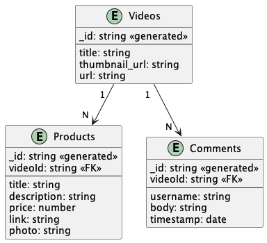

# Tokopedia Play

Welcome, Grader, and also everyone who is reading this.
Thank you for taking your time to review my project.
I hope you enjoy it as much as I do.

This repository contains the source code of Tokopedia Play,
a final project for the course of **Generasi Gigih 3.0 -
Fullstack Engineering**.

## Table of Contents

- [Tokopedia Play](#tokopedia-play)
  - [Table of Contents](#table-of-contents)
  - [Introduction](#introduction)
  - [Features](#features)
  - [Tech Stack](#tech-stack)
  - [Getting Started](#getting-started)
    - [Prerequisites](#prerequisites)
    - [Installation](#installation)
      - [Using Docker](#using-docker)
      - [Using Source Code](#using-source-code)
  - [Backend](#backend)
    - [Database Structure](#database-structure)
      - [Videos](#videos)
      - [Products](#products)
      - [Comments](#comments)
    - [API structure](#api-structure)
    - [List API request and response](#list-api-request-and-response)
      - [GET api/videos](#get-apivideos)
      - [GET api/videos/:id](#get-apivideosid)
      - [GET api/videos/:id/products](#get-apivideosidproducts)
      - [GET api/videos/:id/comments](#get-apivideosidcomments)
      - [POST api/videos/:id/comments](#post-apivideosidcomments)
      - [POST api/seeds](#post-apiseeds)
      - [DELETE api/seeds](#delete-apiseeds)
  - [Frontend](#frontend)
    - [Custom Hooks](#custom-hooks)
      - [useFetch](#usefetch)
      - [useTextLimit](#usetextlimit)
  - [Deployment](#deployment)
  - [Authors](#authors)
  - [Acknowledgements](#acknowledgements)

## Introduction

Tokopedia Play is a video live-streaming and live shopping platform.
It is a platform where users can watch live-streaming videos, add
comments to the videos, and also see the products that are shown in
the videos.

Generasi Gigih is a 6-month bootcamp program by GoTo Impact Foundation.
In the final project of the course, we are required to build a fullstack
application that mimics the functionality of Tokopedia Play.

## Features

- [x] Users can open the app and see a list of live-streaming videos
- [x] Users can watch a live-streaming video
- [x] Users can see a list of products, list comments, and form to add a comment
- [x] Users can submit a comment by filling the form (no authentication required)
- [x] Users can see their comment in the list of comments after submitting
- [x] Loading skeleton is shown while waiting for the data to be fetched

## Tech Stack

- [MongoDB](https://www.mongodb.com/)
- [Express](https://expressjs.com/)
- [React](https://reactjs.org/)
- [Node.js](https://nodejs.org/en/)
- [Mongoose](https://mongoosejs.com/)
- [Faker.js](https://fakerjs.dev/)
- [Tailwind CSS](https://tailwindcss.com/)
- [React Router](https://reactrouter.com/)
- [DaisyUI](https://daisyui.com/)
- [Docker](https://www.docker.com/)
- [Vite](https://vitejs.dev/)

## Getting Started

### Prerequisites

- [Node.js](https://nodejs.org/en/)
- [Docker](https://www.docker.com/)
- [MongoDB](https://www.mongodb.com/)

### Installation

#### Using Docker

1. Pull the Docker image

   ```sh
   docker pull galangaidil/tokopedia-play
   ```

2. Run the Docker image

   ```sh
   docker run -d -p 3000:3000 --env "DATABASE_URL=<Input Your Database Connection String>" galangaidil/tokopedia-play
   ```

3. Open `http://localhost:5173` in your browser
4. Enjoy!

#### Using Source Code

1. Clone the repo

   ```sh
   git clone git@github.com:Galangaidil/tokopedia-play.git
   ```

2. Install NPM packages both in `backend` and `frontend` directories

   ```sh
   cd backend && npm install
   cd ../frontend && npm install
   ```

3. Create `.env` file in `backend` directory

   ```sh
   cd backend && touch .env
   ```

4. Add the following environment variables to `.env` file

   ```sh
   DATABASE_URL=mongodb://localhost:27017/tokopedia-play
   ```

5. Run the backend server

   ```sh
   cd backend && npm start
   ```

6. Now you should see the following message in your terminal

   ```sh
   Running on http://0.0.0.0:3000
   Connected to Database
   ```

7. Open `config.ts` file in `frontend` directory, and set the `API_URL` to `http://localhost:3000`

   ```sh
   export const API_URL = 'http://localhost:3000/api/';
   ```

8. Run the frontend server

   ```sh
   cd frontend && npm run dev
   ```

9. Open `http://localhost:5173` in your browser
10. Enjoy!

## Backend

### Database Structure



From the schema above, we can see that there are three collections in the database:

- `videos`
- `products`
- `comments`

#### Videos

This collection contains data about videos. The schema is as follows:

```json
{
  "_id": "string",
  "title": "string",
  "thumbnail_url": "string",
  "url": "string"
}
```

#### Products

This collection contains data about products. The schema is as follows:

```json
{
  "_id": "string",
  "videoId": "string",
  "title": "string",
  "description": "string",
  "price": "number",
  "link": "string",
  "photo": "string"
}
```

#### Comments

This collection contains data about comments that are posted by users in a video. The schema is as follows:

```json
{
  "_id": "string",
  "videoId": "string",
  "username": "string",
  "body": "string",
  "timestamp": "date"
}
```

The `products` and `comments` collection have a field called `videoId` which is a reference to the `_id` field of the `videos` collection.

### API structure

The backend API is developed using Express and Mongoose.
The API is initialized through `app.js` file.
The API is structured as follows:

```sh
├── app.js
├── routes
│   ├── seeds.js
│   ├── videos.js
└── models
    ├── video.model.js
    ├── product.model.js
    └── comment.model.js
```

### List API request and response

| Endpoint                   | Method   | Request Body | Response Body | Description                         |
| -------------------------- | -------- | ------------ | ------------- | ----------------------------------- |
| `/api/videos`              | `GET`    | -            | `Video[]`     | Get a list of videos                |
| `/api/videos/:id`          | `GET`    | -            | `Video`       | Get a video by its ID               |
| `/api/videos/:id/products` | `GET`    | -            | `Product[]`   | Get a list of products in a video   |
| `/api/videos/:id/comments` | `GET`    | -            | `Comment[]`   | Get a list of comments in a video   |
| `/api/videos/:id/comments` | `POST`   | `Comment`    | `Comment`     | Add a comment to a video            |
| `/api/seeds`               | `POST`   | -            | `string`      | Seeds the database with random data |
| `/api/seeds`               | `DELETE` | -            | `string`      | Delete all data                     |

#### GET api/videos

This API will return a list of videos.

- URL Params:
  - None
- Data Params:
  - None
- Headers:
  - None
- Success Response

  - Code: 200
  - Content:

    ```json
    [
      {
        "_id": "string",
        "title": "string",
        "thumbnail_url": "string"
      }
    ]
    ```

#### GET api/videos/:id

This API will return a video with the specified id.

- URL Params:
  - required: `id=[string]`
- Data Params:
  - None
- Headers:
  - None
- Success Response

  - Code: 200
  - Content:

    ```json
    {
      "_id": "string",
      "title": "string",
      "thumbnail_url": "string",
      "url": "string"
    }
    ```

- Error Response

  - Code: 404
  - Content:

    ```json
    {
      "message": "Video not found"
    }
    ```

#### GET api/videos/:id/products

This API will return a list of products that are related to the video with the specified id.

- URL Params:
  - required: `id=[string]`
- Data Params:
  - None
- Headers:
  - None
- Success Response

  - Code: 200
  - Content:

    ```json
    [
      {
        "_id": "string",
        "videoId": "string",
        "title": "string",
        "price": "number",
        "link": "string",
        "photo": "string"
      }
    ]
    ```

#### GET api/videos/:id/comments

This API will return a list of comments that are related to the video with the specified id.

- URL Params:
  - required: `id=[string]`
- Data Params:
  - None
- Headers:
  - None
- Success Response

  - Code: 200
  - Content:

    ```json
    [
      {
        "_id": "string",
        "videoId": "string",
        "username": "string",
        "body": "string",
        "timestamp": "date"
      }
    ]
    ```

#### POST api/videos/:id/comments

This API will create a new comment for the video with the specified id.

- URL Params:
  - required: `id=[string]`
- Data Params:
  - required: `username=[string]`
  - required: `body=[string]`
- Headers:
- Success Response

  - Code: 201
  - Content:

    ```json
    {
      "_id": "string",
      "videoId": "string",
      "username": "string",
      "body": "string",
      "timestamp": "date"
    }
    ```

- Error Response

  - Code: 422
  - Content:

    ```json
    {
      "message": "Validation failed"
    }
    ```

#### POST api/seeds

This API will seed the database with random data using fakerjs.

- URL Params:
  - None
- Data Params:
  - None
- Headers:
  - None
- Success Response

  - Code: 200
  - Content:

    ```json
    {
      "message": "Seeding data successfully"
    }
    ```

#### DELETE api/seeds

This API will delete all data in the database.

- URL Params:
  - None
- Data Params:
  - None
- Headers:
  - None
- Success Response

  - Code: 200
  - Content:

    ```json
    {
      "message": "Deleting data successfully"
    }
    ```

## Frontend

The user interface is developed utilizing React and Tailwind CSS.
The application is initialized through Vite.
TypeScript is employed for enforcing type checking.

### Custom Hooks

#### useFetch

This hook is used to fetch data from the backend API.

```ts
// Define the interface of the data
interface VideoInterface {
  _id?: string;
  title?: string;
  thumbnail_url?: string;
  url?: string;
}

const {
  data: videos,
  loading,
  error,
} = useFetch<VideoInterface[] || []>("videos", "GET");

// Example

if (loading) {
  return <LoadingSkeleton />;
}

if (error) {
  return <Error message={error.message} />;
}

return <Component data={data} />;
```

#### useTextLimit

This hook is used to limit the number of characters in a text.

```ts
const limitedText = useTextLimit("This is a text", 10);

// result: "This is a..."
```

## Deployment

The backend and frontend are deployed to DigitalOcean App Platform, using Docker.
You can access the deployed app
at [https://coral-app-bus9u.ondigitalocean.app](https://coral-app-bus9u.ondigitalocean.app).

## Authors

- Name: Galang Aidil Akbar
- Email: <galangaidil45@gmail.com>
- Participant ID: GG3FSGP0337

## Acknowledgements

- [GoTo Impact Foundation](https://www.goto-impact.org)
- [Generasi Gigih](https://www.goto-impact.org/generasi-gigih/)
- [Tokopedia Play](https://www.tokopedia.com/play)
- [DigitalOcean App Platform](https://www.digitalocean.com/products/app-platform/)
