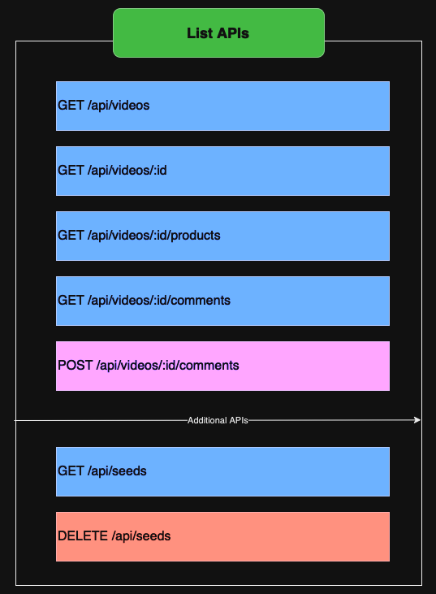

# Tokopedia Play - Backend

This repository contains backend for the final project of
the course "Generasi Gigih 3.0 - Fullstack Engineering" by
[Goto Impact Foundation](https://www.goto-impact.org).

## Database Schema


From the schema above, we can see that there are 3 collections in the database:

- `videos`
- `products`
- `comments`

### Videos

This collection contains data about videos. The schema is as follows:

```json
{
  "_id": "string",
  "title": "string",
  "thumbnail_url": "string"
}
```

### Products

This collection contains data about products. The schema is as follows:

```json
{
  "_id": "string",
  "videoId": "string",
  "title": "string",
  "description": "string",
  "price": "number",
  "link": "string",
  "photo": "string"
}
```

### Comments

This collection contains data about comments that are posted by users in a video. The schema is as follows:

```json
{
  "_id": "string",
  "videoId": "string",
  "username": "string",
  "body": "string",
  "timestamp": "date"
}
```

The `products` and `comments` collection have a field called `videoId` which is a reference to the `_id` field of
the `videos` collection.

## API Structure



As shown in the image above, the API structure is as follows:

- `User` is the user who will consume the API
- `Backend` is the backend server that will serve the API (Node JS and Express JS)
- `MongoDB` is the database that will store the data

inside the `Backend` there are 2 layers:

- `routes` is the layer that will handle the request from the `User` and send the response back to the `User`
- `models` is the layer that will handle the data from the `MongoDB` and send the data back to the `routes`

I don't use `controllers` and `services` layers because the API is very simple and does not require a lot of business
logic. On top of that, `mongoose` already provides a lot of methods to interact with the database, including the
validation one. So I don't need to create another layer to handle the validation and business logic.

## List APIs


As shown in the image above, the list of APIs is as follows:

### GET api/videos

This API will return a list of videos.

- URL Params:
    - None
- Data Params:
    - None
- Headers:
    - None
- Success Response
    - Code: 200
    - Content:
    ```json
          [
            {
              "_id": "string",
              "title": "string",
              "thumbnail_url": "string"
            },
            {
              "_id": "string",
              "title": "string",
              "thumbnail_url": "string"
            }
          ]
    ```

### GET api/videos/:id

This API will return a video with the specified id.

- URL Params:
    - required: `id=[string]`
- Data Params:
    - None
- Headers:
    - None
- Success Response
    - Code: 200
    - Content:

    ```json
           {
              "_id": "string",
              "title": "string",
              "thumbnail_url": "string"
           }
    ```

- Error Response
    - Code: 404
    - Content:

    ```json
          {
            "message": "Video not found"
          }
    ```

### GET api/videos/:id/products

This API will return a list of products that are related to the video with the specified id.

- URL Params:
    - required: `id=[string]`
- Data Params:
    - None
- Headers:
    - None
- Success Response
    - Code: 200
    - Content:

    ```json
          [
            {
              "_id": "string",
              "videoId": "string",
              "title": "string",
              "price": "number",
              "link": "string",
              "photo": "string"
            },
            {
              "_id": "string",
              "videoId": "string",
              "title": "string",
              "price": "number",
              "link": "string",
              "photo": "string"
            }
          ]
    ```

### GET api/videos/:id/comments

This API will return a list of comments that are related to the video with the specified id.

- URL Params:
    - required: `id=[string]`
- Data Params:
    - None
- Headers:
    - None
- Success Response
    - Code: 200
    - Content:

    ```json
          [
            {
              "_id": "string",
              "videoId": "string",
              "username": "string",
              "body": "string",
              "timestamp": "date"
            },
            {
              "_id": "string",
              "videoId": "string",
              "username": "string",
              "body": "string",
              "timestamp": "date"
            }
          ]
    ```

### POST api/videos/:id/comments

This API will create a new comment for the video with the specified id.

- URL Params:
    - required: `id=[string]`
- Data Params:
    - required: `username=[string]`
    - required: `body=[string]`
- Headers:
- Success Response
    - Code: 201
    - Content:

    ```json
          {
            "_id": "string",
            "videoId": "string",
            "username": "string",
            "body": "string",
            "timestamp": "date"
          }
    ```

- Error Response
    - Code: 422
    - Content:

    ```json
          {
            "message": "Validation failed"
          }
    ```

**Additional APIs**

Use these APIs to seed and delete data in the database.

### GET api/seeds

This API will seed the database with some data.

- URL Params:
    - None
- Data Params:
    - None
- Headers:
    - None
- Success Response
    - Code: 200
    - Content:

    ```json
          {
            "message": "Seeding data successfully"
          }
    ```

### DELETE api/seeds

This API will delete all data in the database.

- URL Params:
    - None
- Data Params:
    - None
- Headers:
    - None
- Success Response
    - Code: 200
    - Content:

    ```json
          {
            "message": "Deleting data successfully"
          }
    ```

## How to run it locally

1. Clone this repository

    ```bash
    git clone https://github.com/Galangaidil/tokopedia-play-backend.git
    ```

2. Install dependencies

    ```bash
    npm install
    ```

3. Copy `.env.example` to `.env`

    ```bash
   # for linux and mac users
    cp .env.example .env
   
   # for windows users
    copy .env.example .env 
    ```  

4. Open `.env` file and put your database connection url as follows:

    ```bash
    DATABASE_URL = mongodb://127.0.0.1:27017/final_project
    ```

5. Run the server

    ```bash
    npm start
    ```

6. Now the server is running on port 3000. So you can access it via `http://127.0.0.1:3000` or `http://localhost:3000`

## Test the APIs

You can test the APIs using Postman. You can download it [here](https://www.postman.com/downloads/). If you don't use
postman (like me), you can use the file `rest-api.http` in the root directory of this repository. This file contains all
the APIs that you can test using VSCode. You can install
the [REST Client](https://marketplace.visualstudio.com/items?itemName=humao.rest-client) extension to run the APIs.
After installing the extension, you can open the file `rest-api.http` and click the `Send Request` button to run the
APIs.

## Contact

If you have any questions, feel free to contact me at email below:

- Email: `galangaidil45@gmail.com`

I will be happy to answer your questions :)
